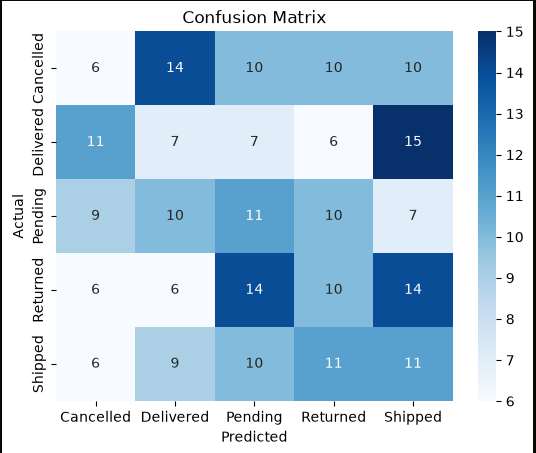
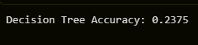
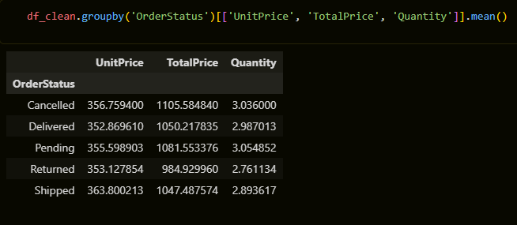

# Order Status Classifier


A supervised learning project that predicts e-commerce order status (Shipped, Cancelled, Returned, Delivered, Pending) from order features.

## Project Overview

- Loaded and explored a 1,200-row e-commerce orders dataset
- Preprocessed data: handled missing values, dropped identifier columns, one-hot encoded categoricals
- Trained and compared two classifiers: Logistic Regression and Decision Tree
- Evaluated using accuracy and classification reports

## Key Finding

Both models perform near random-chance level (~19-24% accuracy on a 5-class problem, where random guessing ≈ 20%). Grouped feature analysis (mean UnitPrice/TotalPrice/Quantity per class) showed no meaningful separation between classes, indicating the dataset does not contain a learnable relationship between the given features and `OrderStatus` — consistent with a synthetically generated practice dataset. This project focuses on demonstrating a correct, production-style ML pipeline (EDA → preprocessing → train/test split → model training → evaluation) rather than optimizing for accuracy on data without real signal.

## Results

### Confusion Matrix



### Classification Report




### Grouped Report



## Tech Stack

Python, pandas, scikit-learn, matplotlib, seaborn, Jupyter

## Project Structure

```
order-status-classifier/
├── data/
│   └── orders.csv
├── notebooks/
│   └── 01_eda.ipynb
├── src/
│   ├── preprocess.py
│   └── train.py
├── assets/
│   ├── confusion_matrix.png
│   └── classification_report.png
├── requirements.txt
└── README.md
```

## How to Run

```
git clone https://github.com/NidaKhaan/order-status-classifier.git
cd order-status-classifier
python -m venv venv
venv\Scripts\activate
pip install -r requirements.txt
cd src
python train.py
```

## Skills Demonstrated

Data handling, missing value strategy, categorical encoding, feature scaling, stratified train/test split, multi-model comparison, critical result evaluation

## Author

Nida Sheraz